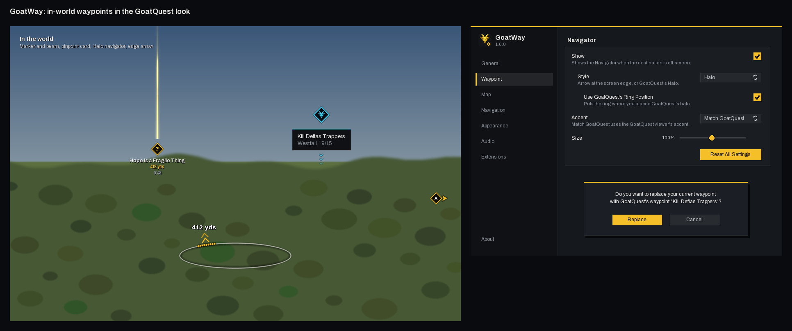

# GoatWay 1.0.0

In-world waypoints and navigation for WoW Forever (**Interface 16001**), in the GoatQuest look.
GoatWay marks your destination in the world, points the way when it is off screen, and follows
GoatQuest's guide arrow. It is based on Waypoint UI 1.7.3 by AdaptiveX, rebranded and restyled.

## First launch

1. GoatWay lives next to GoatQuest in `Interface/AddOns/GoatWay`. Fully exit and restart WoW so
   the new folder is found, then enable **GoatWay (Forever)**.
2. If Waypoint UI is also installed, disable it. Both draw a marker for the same destination;
   GoatWay says so in chat if it finds Waypoint UI enabled.
3. `/gw` (or `/goatway`) opens the settings, also under **Options → AddOns → GoatWay**.

| Command | What it does |
|---|---|
| `/gw` | Opens the settings. |
| `/gw clear` | Clears the destination. |
| `/gw arrow`, `/gw halo` | Picks the Navigator (the same words as GoatQuest's `/gqviewer`). |
| `/way <x> <y> [name]` | Sets a destination on your map. `/way #<mapID> <x> <y> [name]` for another map. When TomTom is loaded, `/way` is TomTom's. |

## What you see

- **Waypoint** (far away): a flat diamond in the accent with the destination's icon, a thin beam,
  and under it the name in the text colour, the distance in the accent and the arrival time muted.
- **Pinpoint** (close, within 100 yds on Forever): a GoatQuest card (ink, 1px hairline, the accent
  rule along its top) with the objectives or description, and three chevrons flowing down to the spot.
- **Navigator**: **Arrow**, a GoatQuest chevron orbiting the destination's icon at the screen edge
  when the destination is off screen; or **Halo**, GoatQuest's ring at your character's feet whose
  notch points toward the destination with the distance beside it. On arrival the ring lights up
  in the accent and says **Here**. For waypoints (GoatQuest's, `/way`, map pins, TomTom) the halo
  points by your facing and the true bearing; for other destinations it points along the screen.

Quests take their kind's colour: ready to turn in in the accent, unfinished in soft grey,
repeatable in blue, important in lilac. Every icon is redrawn flat in GoatQuest's style.

## With GoatQuest

GoatQuest is an optional dependency, so it loads first.

- **Follow GoatQuest's Arrow** (Extensions → GoatQuest, on by default): whatever GoatQuest's arrow
  points at, the step's waypoint or the next leg of a travel route, becomes GoatWay's destination,
  titled from the step and marked with the goat. A new place re-navigates; progress in the title
  (3/8 boars) does not, so the marker's intro does not replay on every kill. Corpse arrows are left
  to the game, and the mark clears when GoatQuest's arrow hides. Turn off **Auto-Replace Waypoint**
  to be asked before GoatQuest replaces something else you are tracking (once per place).
- **Accent** (Appearance → Colour): **Match GoatQuest**, the default, uses the GoatQuest viewer's
  accent, its class colour or your custom colour, and follows it when you change it there. Without
  GoatQuest it is GoatQuest gold. Also **Class Colour**, **GoatQuest Gold** or **Custom**.
- **Halo**: uses the ring position you set with GoatQuest's movers (**Use GoatQuest's Ring
  Position**), or its own **Ring Height**. While GoatQuest's own halo is on screen, GoatWay's steps
  aside so only one ring shows.

## The design

GoatWay uses GoatQuest's tokens (`packages/goatway-style`, matching GoatQuest's
`Skins/Default/GoatQuest/Style.lua`): flat surfaces, square corners, 1px hairlines, no bevels or glows
on panels, and one accent.

| Token | Value | Use |
|---|---|---|
| Ink | `#0F1115` | Sidebar, pinpoint card, marker fill |
| Slate | `#15181D` | Settings content |
| Ridge | `#1B1F25` | Dialogs, menus |
| Hairline | white 7% | Borders, dividers |
| Text / Soft / Muted / Dim | `#ECEAE6` `#C5C8CD` `#8D939C` `#6F757E` | Text by importance |
| Gold | `#F5BF29` | The settings accent, primary buttons, checks |

Type is GoatQuest's: **Archivo** for text (SemiBold for names and headings), **Archivo Narrow** for
distances and times, and **Atkinson Hyperlegible** Bold for the halo's distance. They are the default
**Font**; the game font and LibSharedMedia fonts are still listed. Korean, Chinese and Russian clients
use the game font, which covers their scripts.

The settings keep Waypoint UI's layout, restyled: an ink sidebar with the GoatWay mark, name and
version under a gold rule, muted tabs with a gold bar on the selected one, flat rows and controls,
gold primary buttons with ink text, and dialogs with a gold Replace next to a neutral Cancel.

Textures are drawn by `tools/make_art.py` (`py -3 tools/make_art.py --preview` also writes the
sheets in `design/`), at Waypoint UI's atlas coordinates, as the same uncompressed BLP files. The
halo reuses GoatQuest's own ring, dot and chevron textures, and the fonts are GoatQuest's.
`py -3 tools/make_preview.py` renders `design/preview.png` from the real textures and fonts.

## Changes from Waypoint UI

- The name, TOC, SavedVariables (`GoatWayDB_*`), frame names, API global (`GoatWayAPI`) and slash
  commands (`/gw`, `/goatway`) are GoatWay's. Waypoint UI's settings are not imported.
- New: the accent, the Halo navigator, following GoatQuest's arrow, and the GoatQuest design.
- Fixed: turning the Navigator on or off now takes effect at once; icons for artifact quests exist;
  the arrival-time script's file name matches its include on case-sensitive systems.

## Tests

`py -3 tests/validate.py` needs Python 3.10+ with `lupa` and `Pillow`. It compiles every file in load
order under Lua 5.1, then runs the tests: branding, art, locales, the halo's maths, and GoatWay
running end to end over a WoW API mock (`tests/wowmock.lua`): login, `/way`, the marker, pinpoint
and halo in the GoatQuest colours, the settings window, and following a mock GoatQuest.

The mock models the API GoatWay uses; it is not the game. Check new work in game too.
